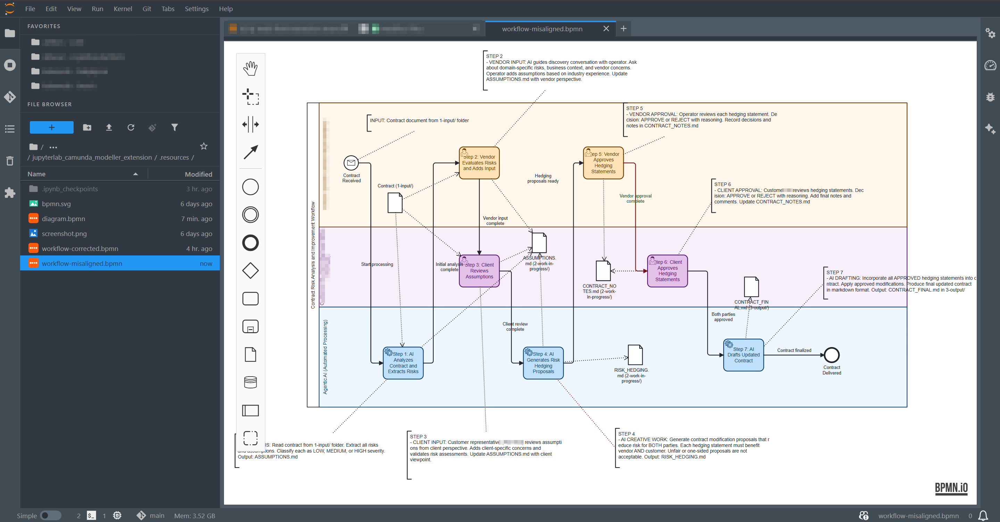

# jupyterlab_camunda_modeller_extension

[](https://github.com/stellarshenson/jupyterlab_camunda_modeller_extension/actions/workflows/build.yml)
[](https://www.npmjs.com/package/jupyterlab_camunda_modeller_extension)
[](https://pypi.org/project/jupyterlab-camunda-modeller-extension/)
[](https://pepy.tech/project/jupyterlab-camunda-modeller-extension)
[](https://jupyterlab.readthedocs.io/en/stable/)
[](https://kolomolo.com)
[](https://www.paypal.com/donate/?hosted_button_id=B4KPBJDLLXTSA)

Model BPMN diagrams and open Camunda BPMN files directly in JupyterLab. This extension provides a visual editor for business process modelling within the JupyterLab environment.



## Features

- **BPMN diagram modelling** - Create and edit BPMN 2.0 diagrams visually
- **Camunda BPMN support** - Open and modify Camunda-specific BPMN files
- **JupyterLab integration** - Native file browser integration for .bpmn files
- **Server-side processing** - Backend support for diagram operations

## Requirements

- JupyterLab >= 4.0.0

## Installation

```bash
pip install jupyterlab-camunda-modeller-extension
```

## Development

> [!IMPORTANT]
> Always use `make install` for development installation. Do not run raw `pip install` or `npm install` commands.

```bash
# Install for development
make install

# Run tests
make test

# Build production package
make build
```

## Uninstall

```bash
pip uninstall jupyterlab_camunda_modeller_extension
```
